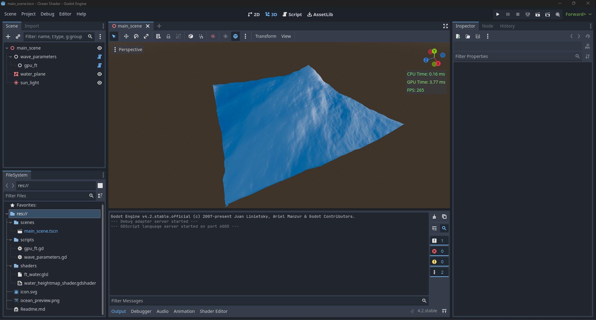

# Godot Ocean Shader experiment

  

A ocean shader written for Godot 4.2 as a personal study to render realistic ocean waves in realtime. It based on the Paper "Simulating Ocean Water" by Jerry Tessendorf which technique is used in movie productions like Titanic or Waterworld. However my implementation runs on the GPU as a compute shader which makes it in theory faster but also incredibly more slow since I only implemented the normal fourier transform here and not the fast one, which would be way more time consuming to code. However it was a really interesting project especially to learn the fourier transformation and how to perform complex mulitplications through programmcode. So if you currently working on something similiar or just want to get started on this, this implementation might help you out in some specific topics.

## License
MIT license (see license.md)

## How to use
The entire code runs from the editor itself, so you first have to regeneate tehe phillips spectrum which you can find unter the node "wave_parameters" with the button "Gen Tex". After that you can go the "gpu_ft" node press "Init GPU and Run" (the editor will show you some weird image after that) and display the actual result by clicking "Run Step" or "Run Continues"  

## Disclaimer
Since this implementation only uses the fourier transform and not the fast fourier transfrom it will run really slowly on your pc if you scale up the image texture while generating the spectrum. Please be aware of that and rather play around with smaller textures :) 